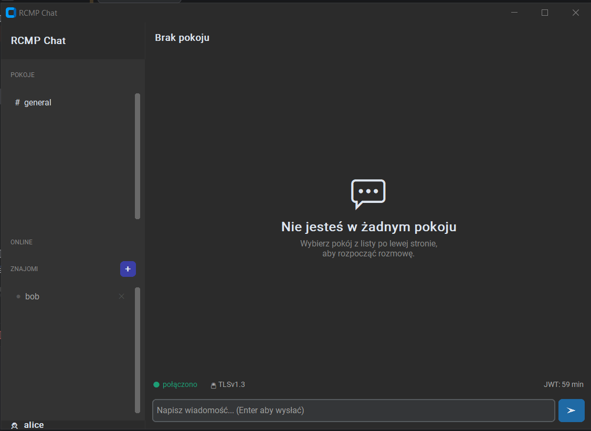
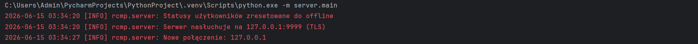
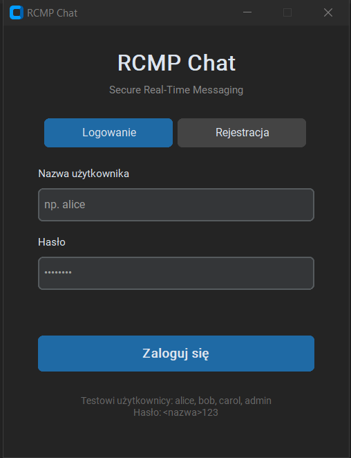
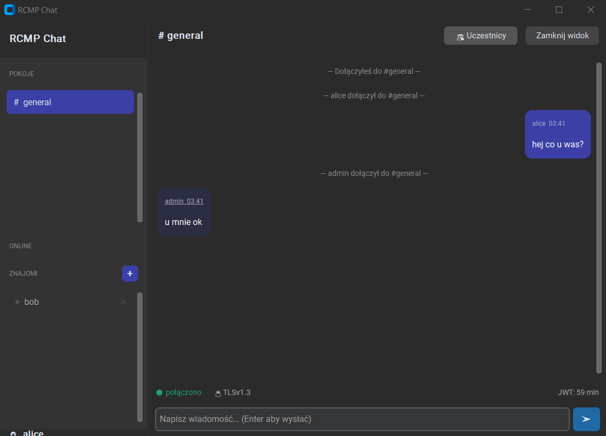
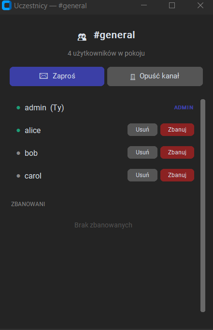
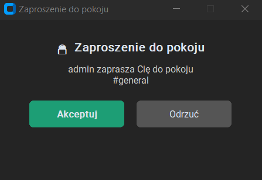
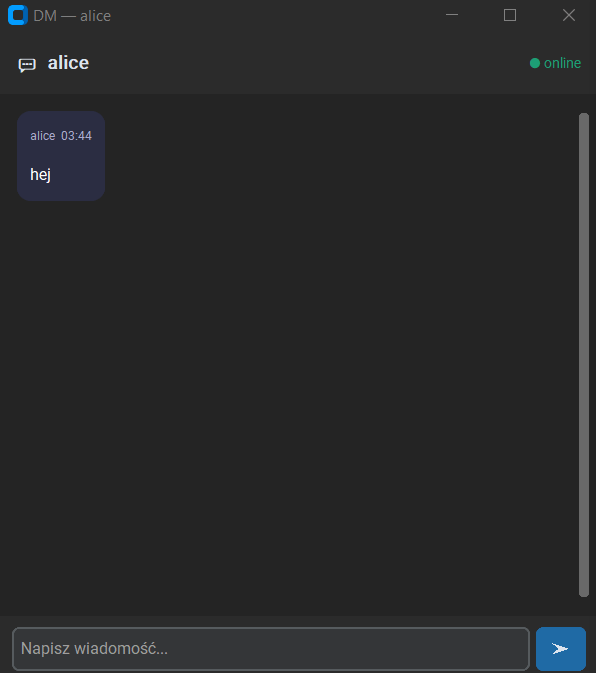
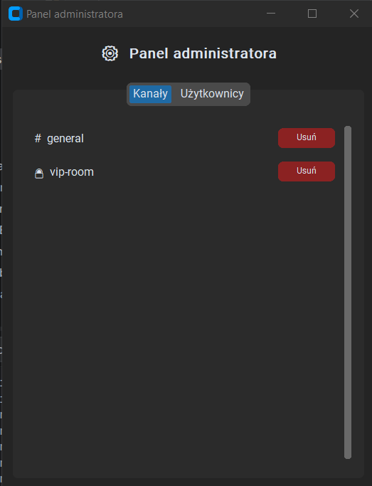
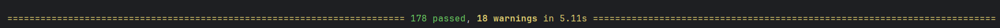

# RCMP Chat — Secure Real-Time Messaging System

**Bartłomiej Żądło, nr albumu: 151505**  
Projekt nr 3 — Programowanie Usług Sieciowych

---

## Spis treści

1. [Opis projektu](#1-opis-projektu)
2. [Zmiany względem poprzednich etapów](#2-zmiany-względem-poprzednich-etapów)
3. [Protokół RCMP](#3-protokół-rcmp)
4. [Architektura aplikacji](#4-architektura-aplikacji)
5. [Schemat bazy danych](#5-schemat-bazy-danych)
6. [Struktura projektu](#6-struktura-projektu)
7. [Wymagania i instalacja](#7-wymagania-i-instalacja)
8. [Uruchomienie](#8-uruchomienie)
9. [Interfejs użytkownika (GUI)](#9-interfejs-użytkownika-gui)
10. [Przypadki użycia](#10-przypadki-użycia)
11. [Bezpieczeństwo](#11-bezpieczeństwo)
12. [Obsługa błędów](#12-obsługa-błędów)
13. [Testy](#13-testy)
14. [Znane ograniczenia](#14-znane-ograniczenia)

---

## 1. Opis projektu

RCMP Chat to aplikacja komunikatora czasu rzeczywistego zbudowana na autorskim protokole warstwy aplikacyjnej **RCMP (Real-Time Chat Messaging Protocol)**. System umożliwia bezpieczną wymianę wiadomości tekstowych pomiędzy użytkownikami w ramach pokoi tematycznych oraz w trybie wiadomości prywatnych 1:1.

Typowe proste rozwiązania socketowe nie zapewniają mechanizmów niezbędnych w produkcyjnym komunikatorze. RCMP Chat implementuje:

- synchroniczną wymianę wiadomości z niskim opóźnieniem,
- zarządzanie sesjami wielu równoczesnych użytkowników,
- śledzenie statusu obecności (online / away / offline),
- potwierdzanie dostarczenia wiadomości (MESSAGE_ACK),
- utrzymanie połączenia przy braku aktywności (PING/PONG keep-alive),
- dołączanie i opuszczanie pokojów w trakcie trwania sesji,
- odporność na utratę połączenia z mechanizmem reconnect i exponential backoff,
- wykrywanie duplikatów wiadomości po `msg_id`,
- ochronę przed replay attack,
- rate limiting i ochronę przed nadużyciami,
- system znajomych z wiadomościami prywatnymi (DM),
- zaproszenia do pokojów prywatnych,
- panel administracyjny (zarządzanie pokojami i użytkownikami),
- moderację pokojów (kick, ban, unban),
- trwałą historię wiadomości — zarówno w pokojach, jak i w DM-ach — zapisywaną w bazie danych i wyświetlaną w GUI po ponownym zalogowaniu (`HISTORY_REQUEST`/`HISTORY_RESPONSE`).

Model działania: **klient–serwer**. Serwer centralny pośredniczy we wszystkich wiadomościach — klienci nie komunikują się bezpośrednio między sobą.

---

## 2. Zmiany względem poprzednich etapów

### Co się zmieniło względem Etapu 1 (specyfikacja protokołu)

Etap 1 definiował rdzeń protokołu RCMP. Podczas implementacji protokół został rozszerzony o szereg typów wiadomości nieobecnych w pierwotnej specyfikacji. Wszystkie rozszerzenia zachowują kompatybilność z oryginalną kopertą (`type`, `msg_id`, `ts`, `token`, `payload`).

| Zmiana | Opis |
|---|---|
| ➕ `ROOMS_LIST` | Dynamiczne pobieranie listy pokojów z serwera zamiast hardcodowania po stronie klienta |
| ➕ `ROOM_INVITE` / `ROOM_INVITE_ACCEPT` / `ROOM_INVITE_DECLINE` | Zaproszenia do pokojów prywatnych przez GUI (w Etapie 1 ACL zarządzano wyłącznie przez administratora) |
| ➕ `FRIEND_REQUEST` / `FRIEND_REQUEST_ACCEPT` / `FRIEND_REQUEST_DECLINE` | System znajomych nieobecny w specyfikacji |
| ➕ `FRIEND_STATUS_UPDATE` / `FRIENDS_LIST` | Powiadomienia o statusach znajomych w czasie rzeczywistym |
| ➕ `DIRECT_MESSAGE` | Wiadomości prywatne 1:1 między znajomymi jako oddzielny typ (w Etapie 1 DM realizowane przez `SEND_MESSAGE` z `target_type=user`) |
| ➕ `FRIEND_REMOVE` | Usuwanie znajomego z listy |
| ➕ `CREATE_ROOM` / `CREATE_ROOM_OK` / `DELETE_ROOM` / `DELETE_ROOM_OK` | Zarządzanie pokojami przez admina przez protokół (w Etapie 1 opisane jako UC7, bez dedykowanych typów wiadomości) |
| ➕ `ROOM_MEMBERS_REQUEST` / `ROOM_MEMBERS_LIST` | Pobieranie listy uczestników pokoju |
| ➕ `ROOM_KICK` / `ROOM_KICK_OK` / `ROOM_BAN` / `ROOM_BAN_OK` / `ROOM_UNBAN` / `ROOM_UNBAN_OK` | Moderacja pokojów — w Etapie 1 brak tych mechanizmów |
| ➕ `ADMIN_USERS_REQUEST` / `ADMIN_USERS_LIST` | Panel admina do przeglądania użytkowników |
| ➕ `DELETE_USER` / `DELETE_USER_OK` / `SET_USER_ROLE` / `SET_USER_ROLE_OK` | Zarządzanie kontami użytkowników przez admina |
| ➕ `ACCOUNT_DELETED` / `ROLE_CHANGED` | Powiadomienia push do klienta o zmianach administracyjnych |
| ➕ Nowe kody błędów | `4033 SELF_ACTION_FORBIDDEN`, `4043 ROOM_BANNED`, `4044 LAST_ADMIN`, `4091 USERNAME_TAKEN`, `4092 USERNAME_INVALID`, `4093 INVALID_ROLE` |
| ➕ `HISTORY_REQUEST` / `HISTORY_RESPONSE` | Planowane w Etapie 1 jako rozszerzenie — **zaimplementowane**; klient pobiera z bazy trwałą historię wiadomości pokoju (przy pierwszym dołączeniu do pokoju w danej sesji) oraz historię DM (przy pierwszym otwarciu okna rozmowy), dzięki czemu wiadomości są widoczne w GUI również po ponownym zalogowaniu. Dodatkowo obsługiwana jest paginacja kursorem `before_ts` — przycisk „Załaduj starsze wiadomości” doładowuje kolejne strony historii ponad domyślny limit `HISTORY_MAX_LIMIT` |

### Co się zmieniło względem Etapu 2 (projekt aplikacji)

Etap 2 definiował architekturę i przypadki użycia. Implementacja różni się w następujących punktach:

| Zmiana | Opis |
|---|---|
| ✅ CLI → **GUI (CustomTkinter)** | Etap 2 wskazywał klienta CLI jako MVP. Zamiast tego zaimplementowano desktopowy interfejs graficzny oparty na bibliotece CustomTkinter. Funkcjonalność protokołu pozostaje identyczna — zmiana dotyczy wyłącznie warstwy prezentacji |
| ✅ System znajomych (DM) | Nie planowany w Etapie 2 — dodany w trakcie implementacji jako naturalne rozszerzenie komunikacji 1:1 |
| ✅ Moderacja pokojów (kick/ban) | Nie było w UC Etapu 2 — zaimplementowane jako rozszerzenie UC7 |
| ✅ Tabele `room_bans`, `room_kicks`, `friendships` | Schemat bazy z Etapu 2 (Users, Rooms, Messages, ACL) rozszerzony o trzy nowe tabele |
| ✅ Kolejkowanie DM i zaproszeń do pokoi offline | Nie planowane w Etapie 2 — DM do offline odbiorcy oraz `ROOM_INVITE` zapisywane są w bazie (`messages.delivered`, tabela `room_invites`) i dostarczane przy najbliższym `LOGIN_OK` zamiast być odrzucane |
| ❌ `BLOCK_USER` / `UNBLOCK_USER` / `FORCE_DISCONNECT` | UC8 z Etapu 2 — **częściowo zrealizowane**: usuwanie kont i wymuszanie rozłączenia działa, dedykowana blokada konta (flaga `is_blocked`) jest w schemacie bazy, ale `BLOCK_USER`/`UNBLOCK_USER` nie są obsługiwane jako osobne typy wiadomości w protokole |
| ✅ `HISTORY_REQUEST` / `HISTORY_RESPONSE` | Planowane jako rozszerzenie w Etapie 2 — **zaimplementowane**; historia wiadomości (pokoje i DM) jest trwale zapisywana w tabeli `messages` i odtwarzana w GUI po ponownym zalogowaniu |


---

## 3. Protokół RCMP

### Założenia techniczne

| Parametr | Wartość |
|---|---|
| Transport | TCP |
| Szyfrowanie | TLS 1.3 |
| Kodowanie | Newline-delimited JSON (`\n`) |
| Dozwolone szyfry | TLS_AES_256_GCM_SHA384, TLS_CHACHA20_POLY1305_SHA256 |

Każda wiadomość to pojedyncza linia JSON zakończona znakiem `\n`. Wybór JSON uzasadniony jest czytelnością podczas debugowania i łatwością walidacji schematu.

### Struktura koperty (envelope)

```json
{
  "type": "<TYP_WIADOMOŚCI>",
  "msg_id": "<UUID v4>",
  "ts": 1715000000123,
  "token": "<session_token>",
  "payload": {}
}
```

| Pole | Wymagane | Opis |
|---|---|---|
| `type` | zawsze | typ wiadomości |
| `msg_id` | zawsze | unikalny UUID v4 wiadomości |
| `ts` | zawsze | Unix timestamp w milisekundach |
| `token` | poza LOGIN/REGISTER | token sesji JWT |
| `payload` | opcjonalne | dane właściwe wiadomości |

### Typy wiadomości — rdzeń protokołu (Etap 1)

| Typ | Kierunek | Opis |
|---|---|---|
| `LOGIN` | C → S | uwierzytelnienie użytkownika |
| `LOGIN_OK` | S → C | potwierdzenie zalogowania, token JWT + hmac_secret |
| `LOGIN_ERR` | S → C | błąd logowania |
| `JOIN_ROOM` | C → S | dołączenie do pokoju |
| `LEAVE_ROOM` | C → S | opuszczenie pokoju |
| `ROOM_EVENT` | S → C | zdarzenie w pokoju (join/leave/deleted) |
| `SEND_MESSAGE` | C → S | wysłanie wiadomości |
| `DELIVER_MESSAGE` | S → C | dostarczenie wiadomości do odbiorcy |
| `MESSAGE_ACK` | C → S | potwierdzenie odebrania wiadomości |
| `STATUS` | C → S | zmiana statusu (online/away) |
| `PING` | C ↔ S | keep-alive |
| `PONG` | S ↔ C | odpowiedź na PING |
| `ERROR` | S → C | błąd protokołu lub aplikacyjny |
| `BYE` | C → S | zamknięcie sesji przez klienta |
| `BYE_ACK` | S → C | potwierdzenie zamknięcia sesji |

### Typy wiadomości — rozszerzenia zaimplementowane

| Typ | Kierunek | Opis |
|---|---|---|
| `REGISTER` | C → S | rejestracja nowego konta |
| `REGISTER_OK` | S → C | potwierdzenie rejestracji |
| `REGISTER_ERR` | S → C | błąd rejestracji |
| `ROOMS_LIST` | S → C | lista dostępnych pokojów |
| `HISTORY_REQUEST` | C → S | żądanie trwałej historii wiadomości pokoju lub DM zapisanej w bazie, z opcjonalną paginacją (`before_ts`) |
| `HISTORY_RESPONSE` | S → C | odpowiedź z historią wiadomości (posortowaną chronologicznie), wraz z flagą `has_more` |
| `ROOM_INVITE` | S → C | zaproszenie do pokoju prywatnego |
| `ROOM_INVITE_ACCEPT` | C → S | akceptacja zaproszenia |
| `ROOM_INVITE_DECLINE` | C → S | odrzucenie zaproszenia |
| `FRIEND_REQUEST` | C → S → C | zaproszenie do znajomych |
| `FRIEND_REQUEST_ACCEPT` | C → S → C | akceptacja zaproszenia do znajomych |
| `FRIEND_REQUEST_DECLINE` | C → S | odrzucenie zaproszenia do znajomych |
| `FRIEND_STATUS_UPDATE` | S → C | zmiana statusu znajomego |
| `FRIENDS_LIST` | S → C | lista znajomych po zalogowaniu |
| `FRIEND_REMOVE` | C → S | usunięcie znajomego |
| `DIRECT_MESSAGE` | C ↔ S ↔ C | wiadomość prywatna między znajomymi |
| `CREATE_ROOM` | C → S | tworzenie pokoju (tylko admin) |
| `CREATE_ROOM_OK` | S → C | potwierdzenie utworzenia pokoju |
| `DELETE_ROOM` | C → S | usunięcie pokoju (tylko admin) |
| `DELETE_ROOM_OK` | S → C | potwierdzenie usunięcia pokoju |
| `ROOM_MEMBERS_REQUEST` | C → S | żądanie listy uczestników |
| `ROOM_MEMBERS_LIST` | S → C | lista uczestników pokoju |
| `ROOM_KICK` | C → S | wyrzucenie użytkownika z pokoju |
| `ROOM_KICK_OK` | S → C | potwierdzenie wyrzucenia |
| `ROOM_BAN` | C → S | zbanowanie użytkownika w pokoju |
| `ROOM_BAN_OK` | S → C | potwierdzenie bana |
| `ROOM_UNBAN` | C → S | odbanowanie użytkownika |
| `ROOM_UNBAN_OK` | S → C | potwierdzenie odbanowania |
| `ADMIN_USERS_REQUEST` | C → S | żądanie listy użytkowników (tylko admin) |
| `ADMIN_USERS_LIST` | S → C | lista wszystkich użytkowników systemu |
| `DELETE_USER` | C → S | usunięcie konta użytkownika (tylko admin) |
| `DELETE_USER_OK` | S → C | potwierdzenie usunięcia konta |
| `SET_USER_ROLE` | C → S | zmiana roli użytkownika (tylko admin) |
| `SET_USER_ROLE_OK` | S → C | potwierdzenie zmiany roli |
| `ACCOUNT_DELETED` | S → C | powiadomienie użytkownika o usunięciu konta |
| `ROLE_CHANGED` | S → C | powiadomienie użytkownika o zmianie roli |

### Timeouty i keep-alive

| Parametr | Wartość |
|---|---|
| Timeout logowania (TCP → LOGIN_OK) | 10 s |
| Interwał PING (klient → serwer) | 30 s |
| Timeout PONG (brak odpowiedzi) | 10 s |
| Timeout sesji (brak aktywności) | 90 s |
| Timeout oczekiwania na MESSAGE_ACK | 5 s |
| Liczba prób retransmisji SEND_MESSAGE | 3 |

### Retransmisja wiadomości

Jeśli klient nie otrzyma `MESSAGE_ACK` w ciągu 5 s, ponawia `SEND_MESSAGE` z tym samym `msg_id` i `seq_id` (maksymalnie 3 razy). Serwer wykrywa duplikat po `msg_id` i odsyła `MESSAGE_ACK` bez ponownego dostarczenia.

### Limity i ochrona przed nadużyciami

| Limit | Wartość |
|---|---|
| Maksymalny rozmiar wiadomości | 64 KB |
| Maksymalnie wiadomości / 10 s / użytkownik | 30 |
| Maksymalnie prób LOGIN / 60 s / IP | 5 |
| Maksymalnie otwartych połączeń / IP | 10 |
| Maksymalnie pokojów na użytkownika | 50 |
| Maksymalna długość nazwy użytkownika / pokoju | 64 znaki |

---

## 4. Architektura aplikacji

```
┌─────────────────┐
│   Client App    │
│   GUI (CTk)     │
│   RCMP Client   │
└────────┬────────┘
         │ TLS/TCP
┌────────▼────────┐
│   RCMP Server   │
│ Session Manager │
│  Room Manager   │
│ Message Router  │
│ Auth Validator  │
│  Rate Limiter   │
└────────┬────────┘
         │
┌────────▼────────┐
│    PostgreSQL   │
│     Users       │
│     Rooms       │
│    Messages     │
│      ACL        │
│   Friendships   │
│  Room Bans/Kick │
└─────────────────┘
```

### Przepływ danych

1. Klient nawiązuje połączenie TCP/TLS z serwerem.
2. Klient wysyła `LOGIN` z `username`, `password`, `nonce`.
3. Serwer weryfikuje dane względem bcrypt hash w bazie, sprawdza nonce.
4. Serwer odsyła `LOGIN_OK` z tokenem JWT i `hmac_secret`.
5. Serwer wysyła `FRIENDS_LIST` oraz `ROOMS_LIST` po zalogowaniu, a następnie dostarcza zaległe DM-y i `ROOM_INVITE` zebrane podczas gdy użytkownik był offline (ramki oznaczone `queued: true` w payloadzie).
6. Klient może dołączać do pokojów oraz wysyłać wiadomości. Przy pierwszym w danej sesji wejściu do pokoju oraz przy pierwszym otwarciu okna DM z danym rozmówcą klient wysyła `HISTORY_REQUEST` i otrzymuje `HISTORY_RESPONSE` z trwałą historią wiadomości pobraną z tabeli `messages` — dzięki temu cała dotychczasowa rozmowa jest widoczna w GUI od razu, także po ponownym zalogowaniu. Jeśli serwer zasygnalizuje flagą `has_more`, że w bazie są jeszcze starsze wiadomości niż te zwrócone w pierwszej stronie, w GUI pojawia się przycisk „Załaduj starsze wiadomości” — jego kliknięcie wysyła kolejny `HISTORY_REQUEST` z kursorem `before_ts` ustawionym na `ts` najstarszej aktualnie posiadanej wiadomości.
7. Serwer przekazuje wiadomości odbiorcom przez `DELIVER_MESSAGE`.
8. Odbiorcy potwierdzają odbiór przez `MESSAGE_ACK`.
9. Po zakończeniu sesji klient wysyła `BYE`, serwer odpowiada `BYE_ACK`.

### Asyncio + Tkinter

GUI działa w głównym wątku Tkintera, a protokół RCMP w osobnym wątku z własną pętlą asyncio. Komunikacja między wątkami odbywa się przez `asyncio.run_coroutine_threadsafe` (GUI → asyncio) oraz `self.after(0, callback)` (asyncio → GUI).


### Logowanie zdarzeń

Kod serwera i klienta używa modułu `logging` ze standardowej biblioteki Pythona. Punkt wejścia serwera (`server/main.py → main()`) konfiguruje `logging.basicConfig` z formatem:

```
2026-06-15 12:34:56 [WARNING] rcmp.server: Timeout logowania: 192.168.1.5
```

| Plik | Poziomy logowania |
|---|---|
| `server/main.py` | `INFO` (start, migracje, połączenia), `WARNING` (timeouty, błędy formatu), `ERROR` (błędy handlerów z `exc_info=True`) |
| `server/handlers/messaging.py` | `WARNING` (błąd HMAC) |
| `client/protocol/connection.py` | `INFO` (reconnect), `WARNING` (błędy połączenia) |
| `client/protocol/sender.py` | `INFO` (retransmisja), `WARNING` (brak ACK, błąd gniazda) |
| `client/protocol/receiver.py` | `INFO` (zamknięcie połączenia), `WARNING` (timeout, błąd odbioru, bufor), `ERROR` (błąd handlera z `exc_info=True`), `DEBUG` (brak handlera) |
| `client/gui/app.py` | `WARNING` (błędy serwera), `DEBUG` (zdarzenia GUI) |
| `client/gui/chat_window.py` | `DEBUG` (zdarzenia GUI) |

Logi serwera (`rcmp.server.*`) i klienta (`rcmp.client.*`) są rozdzielone — można je filtrować niezależnie. Poziom logowania sterowany jest zmienną środowiskową `LOG_LEVEL`:

```bash
python -m server.main                    # domyślnie INFO
LOG_LEVEL=DEBUG python -m server.main    # wszystkie zdarzenia, w tym GUI i brakujące handlery
LOG_LEVEL=WARNING python -m server.main  # tylko ostrzeżenia i błędy
```

---

## 5. Schemat bazy danych

### Tabela `users`

| Kolumna | Typ | Opis |
|---|---|---|
| `id` | SERIAL PK | identyfikator |
| `username` | VARCHAR(64) UNIQUE | nazwa użytkownika |
| `password` | VARCHAR(255) | bcrypt hash hasła |
| `status` | VARCHAR(16) | `online` / `away` / `offline` |
| `role` | VARCHAR(16) | `user` / `admin` |
| `is_blocked` | BOOLEAN | czy konto jest zablokowane |
| `created_at` | TIMESTAMPTZ | data rejestracji |
| `last_seen` | TIMESTAMPTZ | ostatnia aktywność |

### Tabela `rooms`

| Kolumna | Typ | Opis |
|---|---|---|
| `id` | SERIAL PK | identyfikator |
| `name` | VARCHAR(64) UNIQUE | nazwa pokoju |
| `is_private` | BOOLEAN | czy pokój jest prywatny |
| `created_at` | TIMESTAMPTZ | data utworzenia |

### Tabela `room_acl`

| Kolumna | Typ | Opis |
|---|---|---|
| `room_id` | INTEGER FK | pokój |
| `user_id` | INTEGER FK | użytkownik z dostępem |
| `granted_at` | TIMESTAMPTZ | data nadania dostępu |

### Tabela `messages`

| Kolumna | Typ | Opis |
|---|---|---|
| `id` | SERIAL PK | identyfikator |
| `msg_id` | UUID UNIQUE | UUID z protokołu (wykrywanie duplikatów) |
| `seq_id` | INTEGER | numer sekwencyjny nadawcy |
| `sender_id` | INTEGER FK | nadawca |
| `room_id` | INTEGER FK | pokój (NULL jeśli DM) |
| `recipient_id` | INTEGER FK | odbiorca (NULL jeśli pokój) |
| `body` | TEXT | treść wiadomości |
| `hmac` | VARCHAR(64) | HMAC-SHA256 |
| `sent_at` | TIMESTAMPTZ | czas wysłania |
| `delivered` | BOOLEAN | `FALSE` dla DM wysłanej do offline odbiorcy — dostarczana przy jego najbliższym `LOGIN_OK`. Wiadomości do pokoju zawsze `TRUE` (broadcast, bez kolejkowania) |

Tabela `messages` jest jedynym trwałym źródłem historii wiadomości — obsługuje zarówno kolejkowanie DM do offline odbiorców, jak i `HISTORY_REQUEST`/`HISTORY_RESPONSE` (pełna historia pokoju lub konwersacji DM, posortowana po `sent_at`, zwracana klientowi niezależnie od statusu `delivered`). Kolumna `sent_at` pełni też rolę kursora paginacji: żądanie kolejnej strony filtruje po `sent_at < before_ts`, a odpowiedź informuje flagą `has_more`, czy w bazie pozostały jeszcze starsze wiadomości do doładowania.

### Tabela `friendships` *(nowa względem Etapu 2)*

| Kolumna | Typ | Opis |
|---|---|---|
| `id` | SERIAL PK | identyfikator |
| `user_id` | INTEGER FK | nadawca zaproszenia |
| `friend_id` | INTEGER FK | odbiorca zaproszenia |
| `status` | VARCHAR(16) | `pending` / `accepted` / `declined` |
| `created_at` | TIMESTAMPTZ | data wysłania zaproszenia |
| `updated_at` | TIMESTAMPTZ | data ostatniej zmiany |

### Tabela `room_bans` *(nowa względem Etapu 2)*

| Kolumna | Typ | Opis |
|---|---|---|
| `room_id` | INTEGER FK | pokój |
| `user_id` | INTEGER FK | zbanowany użytkownik |
| `banned_by` | INTEGER FK | admin który nałożył bana |
| `banned_at` | TIMESTAMPTZ | data bana |

### Tabela `room_kicks` *(nowa względem Etapu 2)*

| Kolumna | Typ | Opis |
|---|---|---|
| `room_id` | INTEGER FK | pokój |
| `user_id` | INTEGER FK | wyrzucony użytkownik |
| `kicked_by` | INTEGER FK | admin który wyrzucił |
| `kicked_at` | TIMESTAMPTZ | data wyrzucenia |

### Tabela `room_invites` *(nowa — kolejkowanie offline)*

| Kolumna | Typ | Opis |
|---|---|---|
| `id` | SERIAL PK | identyfikator |
| `room_id` | INTEGER FK | pokój, do którego zaproszono |
| `invited_user_id` | INTEGER FK | zaproszony użytkownik |
| `invited_by` | VARCHAR(64) | nazwa użytkownika, który zaprosił |
| `created_at` | TIMESTAMPTZ | data wysłania zaproszenia |

Wiersz tworzony tylko gdy zapraszany jest offline w momencie wysyłki `ROOM_INVITE`. Dostarczany i usuwany przy jego najbliższym `LOGIN_OK`.

### Tabela `used_nonces`

Przechowuje jednorazowe nonce z loginów (ochrona przed replay attack). Wpisy wygasają po 300 s.

### Tabela `system_logs`

Przechowuje zdarzenia: `LOGIN_FAILED`, `HMAC_ERROR`, `RATE_LIMIT`, błędy serwera itd.

---

## 6. Struktura projektu

```
rcmp_chat/
│
├── server/                        # serwer RCMP
│   ├── main.py                    # punkt wejścia serwera
│   ├── config.py                  # konfiguracja (port, timeouty, limity)
│   ├── session.py                 # Session, SessionManager
│   └── handlers/                  # handlery typów wiadomości
│   │   ├── login.py               # LOGIN → LOGIN_OK / LOGIN_ERR
│   │   ├── messaging.py           # SEND_MESSAGE, DELIVER_MESSAGE, MESSAGE_ACK
│   │   ├── rooms.py               # JOIN_ROOM, LEAVE_ROOM, ROOM_EVENT, invite, kick, ban
│   │   ├── history.py             # HISTORY_REQUEST → HISTORY_RESPONSE (trwała historia pokoju/DM)
│   │   ├── keepalive.py           # PING / PONG
│   │   ├── bye.py                 # BYE → BYE_ACK
│   │   ├── register.py            # REGISTER → REGISTER_OK / REGISTER_ERR
│   │   ├── friends.py             # FRIEND_REQUEST, DM, FRIENDS_LIST
│   │   ├── invite.py              # ROOM_INVITE, ROOM_INVITE_ACCEPT/DECLINE
│   │   └── admin.py               # CREATE/DELETE_ROOM, DELETE_USER, SET_USER_ROLE
│   └── managers/
│       ├── auth.py                # JWT, bcrypt, nonce, rate limit loginów
│       ├── room_manager.py        # zarządzanie pokojami in-memory i ACL
│       ├── rate_limiter.py        # rate limiting wiadomości i połączeń
│       └── message_router.py     # routing wiadomości do sesji odbiorców
│
├── client/                        # klient RCMP
│   ├── main.py                    # punkt wejścia klienta
│   ├── protocol/
│   │   ├── connection.py          # TCP/TLS connect, reconnect, backoff
│   │   ├── sender.py              # wysyłanie ramek, retransmisja, HMAC
│   │   └── receiver.py            # odbieranie ramek, buforowanie do \n
│   └── gui/
│       ├── app.py                 # główne okno aplikacji
│       ├── login_window.py        # okno logowania i rejestracji
│       ├── chat_window.py         # główny widok czatu
│       └── widgets.py             # komponenty: bąbelki, sidebar, dialogi
│
├── shared/                        # kod współdzielony klient–serwer
│   ├── message_types.py           # stałe typów wiadomości i zbiór ALL
│   ├── error_codes.py             # kody błędów i ich opisy
│   ├── schemas.py                 # validate_envelope()
│   └── crypto.py                  # HMAC-SHA256
│
├── tests/
│   ├── test_server/
│   │   ├── test_auth.py           # AuthManager: nonce, rate limit, JWT, bcrypt (22 testy)
│   │   ├── test_messaging.py      # Session duplikaty, SessionManager, validate_envelope (25 testów)
│   │   ├── test_rate_limiter.py   # RateLimiter: wiadomości, logowania, połączenia (19 testów)
│   │   ├── test_room_manager.py   # RoomManager: dostęp, join/leave, moderacja (17 testów)
│   │   └── test_admin.py          # handlery admin: pokoje, użytkownicy, role (28 testów)
│   └── test_client/
│       ├── test_connection.py     # (placeholder)
│       └── test_sender.py         # (placeholder)
│
├── scripts/
│   ├── generate_certs.sh          # generowanie self-signed certyfikatów TLS
│   ├── init_db.sql                # schemat bazy danych
│   ├── seed_db.py                 # testowe dane (użytkownicy, pokoje)
│   ├── migrate_add_room_bans.sql  # migracja: tabela room_bans
│   ├── migrate_add_room_kicks.sql # migracja: tabela room_kicks
│   └── clear_friendships.py      # narzędzie diagnostyczne: czyszczenie znajomych
│
├── certs/                         # certyfikaty TLS (nie commitować)
├── .env                           # zmienne środowiskowe (nie commitować)
├── .env.example                   # wzór pliku .env
├── pytest.ini                     # konfiguracja pytest (asyncio_mode = auto)
└── requirements.txt
```

---

## 7. Wymagania i instalacja

### Wymagania systemowe

- Python 3.12+
- PostgreSQL 15+
- OpenSSL (do generowania certyfikatów TLS)

### Zależności Python

```
asyncpg==0.29.0          # async driver do PostgreSQL
PyJWT==2.8.0             # generowanie i walidacja tokenów JWT
bcrypt==4.1.3            # hashowanie haseł
python-dotenv==1.0.1     # wczytywanie zmiennych środowiskowych z .env
customtkinter==5.2.2     # GUI (nakładka na tkinter)
cryptography==42.0.5     # HMAC-SHA256, TLS utilities
pytest==8.2.0
pytest-asyncio==0.23.6
```

### Instalacja

```bash
git clone <repo>
cd rcmp_chat
python -m venv .venv
.venv\Scripts\activate        # Windows
# source .venv/bin/activate   # Linux/Mac
pip install -r requirements.txt
```

### Konfiguracja `.env`

```bash
cp .env.example .env
# Uzupełnij .env swoimi danymi
```

Plik `.env.example`:

```
SERVER_HOST=127.0.0.1
SERVER_PORT=9999
TLS_CERT_PATH=certs/server.crt
TLS_KEY_PATH=certs/server.key

DB_HOST=localhost
DB_PORT=5432
DB_NAME=rcmp_chat
DB_USER=rcmp_user
DB_PASSWORD=zmien_mnie

JWT_SECRET=bardzo_tajny_klucz_zmien_mnie
JWT_TTL_SECONDS=3600

TIMEOUT_LOGIN=10
TIMEOUT_SESSION=90
TIMEOUT_PONG=10
PING_INTERVAL=30
```

### Baza danych

```bash
psql -U postgres -p 5433 -c "CREATE DATABASE rcmp_chat;"
psql -U postgres -p 5433 -d rcmp_chat -f scripts/init_db.sql
python scripts/seed_db.py   # opcjonalne dane testowe
```

### Certyfikaty TLS

```bash
bash scripts/generate_certs.sh
```

Certyfikaty zostaną wygenerowane w katalogu `certs/`. Nie commitować do repozytorium.

---

## 8. Uruchomienie

### Serwer

```bash
python -m server.main
```

### Klient

```bash
python -m client.main
```

### Testy

```bash
pytest tests/ -v
```



---

## 9. Interfejs użytkownika (GUI)

### Okno logowania / rejestracji

Ekran startowy zawiera pola `username` i `password` oraz przyciski **Zaloguj** i **Zarejestruj**. Błędy logowania wyświetlane są jako czerwony komunikat pod formularzem.



### Główne okno czatu (ChatWindow)

Podzielone na dwie sekcje:

- **Sidebar (lewy panel)** — lista pokojów z przyciskiem `+` do przeglądania/dołączania, sekcja `ZNAJOMI` z kolorowymi wskaźnikami statusu (🟢 online, 🟡 away, ⚫ offline).
- **Obszar czatu (prawy panel)** — historia wiadomości bieżącego pokoju z bąbelkami, pole tekstowe i przycisk wysyłania. Historia jest trwała: przy pierwszym w danej sesji wejściu do pokoju klient pobiera z serwera (`HISTORY_REQUEST`/`HISTORY_RESPONSE`) wszystkie wcześniejsze wiadomości zapisane w bazie, więc rozmowa jest widoczna od razu po zalogowaniu — również po restarcie aplikacji lub ponownym połączeniu.



### Widok użytkowników i zapraszanie do pokoju

Aplikacja udostępnia listę aktualnie dostępnych użytkowników online. Użytkownik może przeglądać aktywnych uczestników oraz inicjować zaproszenie do prywatnego pokoju rozmów.

Po wysłaniu zaproszenia odbiorca otrzymuje okno dialogowe umożliwiające zaakceptowanie lub odrzucenie zaproszenia. Po zaakceptowaniu obaj użytkownicy zostają przeniesieni do prywatnego pokoju, w którym mogą prowadzić rozmowę.

#### Widok użytkowników



#### Akceptacja zaproszenia do pokoju



### Direct Messages (DM)

Kliknięcie znajomego otwiera okno DM z historią rozmowy prywatnej. Okno minimalizuje się zamiast zamykać — historia wiadomości dostępna po ponownym otwarciu. Przy pierwszym otwarciu okna z danym rozmówcą w danej sesji klient pobiera z bazy pełną, trwałą historię konwersacji (`HISTORY_REQUEST`/`HISTORY_RESPONSE`), więc cała dotychczasowa rozmowa jest widoczna od razu — także po ponownym zalogowaniu na innym urządzeniu lub po restarcie aplikacji.



### Panel administracyjny

Dostępny wyłącznie dla roli `admin`. Umożliwia przeglądanie wszystkich użytkowników, zmianę ról (user/admin) i usuwanie kont. Usuniętemu użytkownikowi wyświetlane jest powiadomienie `ACCOUNT_DELETED` i sesja jest zamykana.



## 10. Przypadki użycia

### UC1 — Logowanie użytkownika

Klient wysyła `LOGIN` z `username`, `password` i jednorazowym `nonce`. Serwer weryfikuje dane względem bcrypt hash w bazie, sprawdza nonce pod kątem replay attack. Przy sukcesie odsyła `LOGIN_OK` z tokenem JWT i `hmac_secret`, a następnie `FRIENDS_LIST` i `ROOMS_LIST`. Przy błędnych danych — `LOGIN_ERR 4011`. Po 5 nieudanych próbach w ciągu 60 s — `LOGIN_ERR 4012`.

### UC1b — Rejestracja użytkownika *(nowy względem Etapu 2)*

Klient wysyła `REGISTER` z `username` i `password`. Serwer waliduje format nazwy, sprawdza unikalność w bazie, hashuje hasło bcrypt i zwraca `REGISTER_OK`. W przypadku błędu (zajęta nazwa, niepoprawny format) zwraca `REGISTER_ERR` z odpowiednim kodem.

### UC2 — Dołączenie do pokoju

Klient wysyła `JOIN_ROOM` z `room_id`. Serwer sprawdza istnienie pokoju i uprawnienia (ACL dla pokojów prywatnych, brak bana). Przy sukcesie rozsyła `ROOM_EVENT` do pozostałych uczestników.

### UC3 — Wysłanie wiadomości do pokoju

Klient generuje `SEND_MESSAGE` z `target_type=room`, `target_id`, `seq_id`, `body` i obliczonym HMAC-SHA256. Serwer weryfikuje HMAC, sprawdza rate limit, zapisuje wiadomość w bazie i rozsyła `DELIVER_MESSAGE`. Odbiorcy odsyłają `MESSAGE_ACK`.

### UC4 — Wiadomość prywatna (DM)

Klient wysyła `DIRECT_MESSAGE` do znajomego. Jeśli odbiorca ma aktywną sesję, serwer przekazuje wiadomość bezpośrednio (`delivered = TRUE` w bazie). Jeśli odbiorca jest offline, wiadomość zapisywana jest w tabeli `messages` z `delivered = FALSE` i dostarczana automatycznie przy jego najbliższym `LOGIN_OK`, w kolejności wysłania. Nadawca otrzymuje `MESSAGE_ACK` niezależnie od statusu odbiorcy — brak sesji odbiorcy nie jest błędem.

### UC5 — Utrata połączenia i reconnect

Klient wykrywa brak `PONG` po 10 s od wysłania `PING` i uznaje połączenie za zerwane. Inicjuje reconnect z exponential backoff: 1 s, 2 s, 4 s, 8 s, maksymalnie 60 s. Po ponownym połączeniu wykonuje nowy `LOGIN`.

### UC6 — Próba wejścia do prywatnego pokoju bez uprawnień

Klient wysyła `JOIN_ROOM` dla pokoju prywatnego. Serwer sprawdza ACL — jeśli użytkownik nie figuruje na liście, odsyła `ERROR 4032 FORBIDDEN`. Sesja pozostaje aktywna.

### UC7 — Zarządzanie pokojami przez administratora

Administrator z rolą `admin` w tokenie JWT może tworzyć (`CREATE_ROOM`) i usuwać (`DELETE_ROOM`) pokoje. Usunięcie pokoju rozsyła `ROOM_EVENT` z `event=deleted` do wszystkich uczestników i czyści stan in-memory serwera.

### UC8 — Zarządzanie użytkownikami przez administratora

Administrator może przeglądać użytkowników (`ADMIN_USERS_REQUEST`), usuwać konta (`DELETE_USER`) i zmieniać role (`SET_USER_ROLE`). Usunięcie konta online użytkownika powoduje wysłanie `ACCOUNT_DELETED` i zamknięcie jego sesji. Zmiana roli online użytkownikowi powoduje wysłanie `ROLE_CHANGED` i aktualizację sesji w pamięci. Serwer chroni przed usunięciem ostatniego administratora (`4044 LAST_ADMIN`).

### UC9 — Moderacja pokoju *(nowy względem Etapu 2)*

Administrator może wyrzucić (`ROOM_KICK`) lub zbanować (`ROOM_BAN`) użytkownika z pokoju. Wyrzucony użytkownik traci dostęp do pokoju do czasu nowego zaproszenia. Zbanowany użytkownik nie może ponownie dołączyć do pokoju nawet po zaproszeniu. Ban można cofnąć przez `ROOM_UNBAN`.

### UC10 — System znajomych *(nowy względem Etapu 2)*

Użytkownik wysyła `FRIEND_REQUEST` do innego użytkownika online. Odbiorca widzi dialog i może zaakceptować (`FRIEND_REQUEST_ACCEPT`) lub odrzucić (`FRIEND_REQUEST_DECLINE`). Po akceptacji obaj pojawiają się na swoich listach znajomych. Statusy znajomych aktualizowane są w czasie rzeczywistym przez `FRIEND_STATUS_UPDATE`.

### UC11 — Trwała historia wiadomości *(nowy — HISTORY_REQUEST/HISTORY_RESPONSE)*

Przy pierwszym w danej sesji wejściu do pokoju klient wysyła `HISTORY_REQUEST` z `history_type=room` i `room_id`. Serwer sprawdza, czy użytkownik jest członkiem pokoju lub ma do niego dostęp (ACL/publiczny/bez wyrzucenia), po czym odpytuje tabelę `messages` i zwraca `HISTORY_RESPONSE` z wiadomościami posortowanymi chronologicznie (domyślnie ostatnie 100, maksymalnie 200). Analogicznie, przy pierwszym otwarciu okna DM z danym użytkownikiem klient wysyła `HISTORY_REQUEST` z `history_type=dm` i `username` rozmówcy — serwer zwraca pełną historię konwersacji w obu kierunkach. Dzięki temu wszystkie wiadomości — zarówno kanałowe, jak i prywatne — są zapisywane na stałe w bazie i widoczne w GUI natychmiast po (ponownym) zalogowaniu, niezależnie od tego, czy użytkownik był online w chwili ich wysłania. Brak dostępu do pokoju kończy się `ERROR 4032 FORBIDDEN`, nieznany rozmówca DM — `ERROR 4042 USER_NOT_FOUND`.

**Paginacja — infinite scroll.** Ponieważ pojedyncza odpowiedź zwraca maksymalnie `HISTORY_MAX_LIMIT` (200) wiadomości, dłuższe konwersacje wymagają doładowania kolejnych, starszych porcji historii. Klient przechowuje `ts` najstarszej aktualnie posiadanej wiadomości oraz flagę `has_more` zwróconą przez serwer w poprzedniej odpowiedzi. Jeśli `has_more=true` i użytkownik przewinie czat do góry (5% od początku), automatycznie wysyłany jest kolejny `HISTORY_REQUEST` z dodatkowym polem `before_ts` ustawionym na znacznik czasu najstarszej wiadomości. Serwer filtruje wtedy wiadomości warunkiem `sent_at < before_ts`, sprawdza dodatkowym zapytaniem, czy w bazie istnieją jeszcze starsze wiadomości, i zwraca kolejną stronę wraz z zaktualizowaną flagą `has_more` oraz odesłanym `before_ts` (po którym klient rozpoznaje, że to odpowiedź na doładowanie, a nie pierwsze pobranie historii). Pobrane w ten sposób wiadomości są doklejane na początku lokalnej historii, przed dotychczas wyświetlanymi wiadomościami. Mechanizm zapobiega wielokrotnemu ładowaniu tej samej strony.

---

## 11. Bezpieczeństwo

### Poufność

Całe połączenie szyfrowane przez TLS 1.3. Dozwolone szyfry: `TLS_AES_256_GCM_SHA384`, `TLS_CHACHA20_POLY1305_SHA256`. Certyfikat serwera weryfikowany przez klienta.

### Integralność wiadomości

Każda wiadomość `SEND_MESSAGE` zawiera pole `hmac` — HMAC-SHA256 z konkatenacji `msg_id + ts + seq_id + body`. Klucz (`hmac_secret`) wymieniany przy logowaniu w `LOGIN_OK`, chroniony przez TLS.

### Uwierzytelnienie

Klient wysyła `username + password + nonce`. Hasło nigdy nie jest eksponowane w sieci (TLS). Serwer weryfikuje względem `bcrypt(password)` i wydaje token JWT (HS256, TTL 3600 s).

### Ochrona przed replay

- pole `nonce` w `LOGIN` — jednorazowe, serwer przechowuje użyte nonce przez 300 s (w pamięci i tabeli `used_nonces`),
- pole `ts` — serwer odrzuca wiadomości z timestampem oddalonym o więcej niż ±300 s (błąd 4003),
- pole `msg_id` — serwer przechowuje odebrane `msg_id` przez 5 minut; duplikat jest odrzucany.

### Model zagrożeń

| Zagrożenie | Mechanizm ochrony |
|---|---|
| Podsłuch komunikacji | TLS 1.3 |
| Podszywanie się pod użytkownika | JWT + HMAC, hasło chronione przez TLS |
| Replay attack | nonce + timestamp + msg_id cache |
| Fałszowanie treści wiadomości | HMAC-SHA256 na body |
| Brute-force logowania | rate limit: max 5 prób / 60 s / IP |
| Flooding serwera | max 64 KB / wiadomość, max 30 wiad. / 10 s / użytkownik |
| Przejęcie sesji | JWT z TTL, unieważnienie po BYE |
| Działanie admina na własnym koncie | błąd 4033 SELF_ACTION_FORBIDDEN |
| Usunięcie ostatniego admina | błąd 4044 LAST_ADMIN |

---

## 12. Obsługa błędów

### Kody błędów

| Kod | Nazwa | Znaczenie |
|---|---|---|
| 4001 | MALFORMED_ENVELOPE | brak wymaganego pola w kopercie |
| 4002 | UNKNOWN_TYPE | nieznany typ wiadomości |
| 4003 | TIMESTAMP_SKEW | timestamp poza oknem ±300 s |
| 4004 | MESSAGE_TOO_LARGE | wiadomość przekracza 64 KB |
| 4005 | INVALID_HMAC | błąd weryfikacji HMAC |
| 4011 | LOGIN_FAILED | błędne dane logowania |
| 4012 | LOGIN_RATE_LIMIT | przekroczono limit prób logowania |
| 4031 | UNAUTHORIZED | brak lub nieważny token sesji |
| 4032 | FORBIDDEN | brak uprawnień do zasobu |
| 4033 | SELF_ACTION_FORBIDDEN | próba wykonania operacji na własnym koncie |
| 4041 | ROOM_NOT_FOUND | pokój nie istnieje |
| 4042 | USER_NOT_FOUND | nieznany użytkownik |
| 4043 | ROOM_BANNED | użytkownik jest zbanowany w pokoju |
| 4044 | LAST_ADMIN | nie można usunąć ostatniego administratora |
| 4091 | USERNAME_TAKEN | nazwa użytkownika jest zajęta |
| 4092 | USERNAME_INVALID | niepoprawny format nazwy użytkownika |
| 4093 | INVALID_ROLE | niepoprawna rola (dozwolone: user, admin) |
| 4291 | SEND_RATE_LIMIT | przekroczono limit wiadomości |
| 5001 | SERVER_ERROR | wewnętrzny błąd serwera |
| 5002 | SERVER_OVERLOAD | serwer przeciążony |

### Zachowanie po błędach

- błąd formatu (4001–4004): serwer odsyła `ERROR` i zamyka TCP po 3 kolejnych błędach w ciągu 60 s,
- błąd HMAC (4005): wiadomość odrzucona, sesja utrzymana,
- błąd autoryzacji (4031): po 3 wystąpieniach w ciągu 60 s — rozłączenie,
- rate limit (4291): okno max 30 wiadomości / 10 s / użytkownik.

---

## 13. Testy

### Przegląd pokrycia

Testy jednostkowe obejmują **210 przypadków testowych** w 9 plikach testowych.

| Plik | Moduł | Liczba testów |
|---|---|---|
| `test_auth.py` | `AuthManager` | 22 |
| `test_messaging.py` | `Session`, `SessionManager`, `validate_envelope` | 25 |
| `test_rate_limiter.py` | `RateLimiter` | 19 |
| `test_room_manager.py` | `RoomManager` | 17 |
| `test_admin.py` | handlery admin | 28 |
| `test_offline_queue.py` | kolejkowanie DM i `ROOM_INVITE` offline | 11 |
| `test_history.py` | `HISTORY_REQUEST`/`HISTORY_RESPONSE` — historia pokoju i DM, w tym paginacja `before_ts`/`has_more` | 21 |
| `test_connection.py` | `RCMPConnection` | 27 |
| `test_sender.py` | `RCMPSender` | 36 |
| **Razem** | | **210** |

Testy klienta (`test_connection.py`, `test_sender.py`) pokrywają całą logikę warstwy protokołu po stronie klienta bez GUI i bez rzeczywistego połączenia sieciowego.

### test_auth.py — AuthManager (22 testy)

**Nonce (4 testy)**

| Test | Opis |
|---|---|
| `test_fresh_nonce_accepted` | nonce użyty po raz pierwszy jest akceptowany |
| `test_duplicate_nonce_rejected` | ten sam nonce odrzucony przy drugim użyciu |
| `test_different_nonces_accepted` | różne nonce są niezależne |
| `test_expired_nonce_cleared_and_accepted_again` | nonce starszy niż TTL jest usuwany i akceptowany ponownie |

**Rate limit logowań (5 testów)**

| Test | Opis |
|---|---|
| `test_first_attempt_allowed` | pierwsza próba logowania zawsze dozwolona |
| `test_within_limit_allowed` | próby do limitu MAX_LOGIN_ATTEMPTS dozwolone |
| `test_exceeding_limit_blocked` | próba po przekroczeniu limitu zablokowana |
| `test_different_ips_independent` | blokada jednego IP nie wpływa na inne |
| `test_old_attempts_expire` | stare próby (>60 s) wygasają, okno resetuje się |

**JWT (4 testy)**

| Test | Opis |
|---|---|
| `test_generate_and_verify_token` | wygenerowany token zawiera poprawne pola sub/username/role |
| `test_expired_token_returns_none` | wygasły token nie jest akceptowany |
| `test_invalid_token_returns_none` | niepoprawny string zwraca None |
| `test_token_with_wrong_secret_returns_none` | token podpisany złym kluczem zwraca None |

**Hashowanie haseł (3 testy)**

| Test | Opis |
|---|---|
| `test_hash_is_not_plaintext` | hash nie jest równy plaintext |
| `test_hash_verifiable_with_bcrypt` | hash jest weryfikowalny przez bcrypt |
| `test_different_calls_produce_different_hashes` | każde wywołanie produkuje inny hash (losowy salt) |

**Weryfikacja użytkownika (4 testy)**

| Test | Opis |
|---|---|
| `test_valid_credentials_return_user` | poprawne dane zwracają użytkownika |
| `test_wrong_password_returns_none` | błędne hasło zwraca None |
| `test_nonexistent_user_returns_none` | nieistniejący użytkownik zwraca None |
| `test_blocked_user_returns_none` | zablokowane konto zwraca None |

**HMAC secret (2 testy)**

| Test | Opis |
|---|---|
| `test_generates_non_empty_string` | `generate_hmac_secret()` zwraca niepusty string |
| `test_generates_unique_secrets` | kolejne wywołania zwracają różne wartości |

### test_messaging.py — Session, SessionManager, validate_envelope (25 testów)

**Wykrywanie duplikatów (5 testów)**

| Test | Opis |
|---|---|
| `test_first_msg_not_duplicate` | pierwsze wystąpienie msg_id nie jest duplikatem |
| `test_same_msg_id_is_duplicate` | to samo msg_id jest duplikatem |
| `test_different_msg_ids_not_duplicate` | różne msg_id są niezależne |
| `test_expired_msg_id_cleared` | msg_id starszy niż 300 s jest usuwany |
| `test_fresh_msg_id_retained` | świeże msg_id pozostaje w cache |

**Liczniki błędów (4 testy)**

| Test | Opis |
|---|---|
| `test_format_error_increments` | licznik błędów formatu rośnie |
| `test_auth_error_increments` | licznik błędów autoryzacji rośnie |
| `test_format_errors_expire` | stare błędy (>60 s) wygasają |
| `test_auth_errors_expire` | stare błędy autoryzacji wygasają |

**SessionManager (5 testów)**

| Test | Opis |
|---|---|
| `test_create_session_returns_session` | `create_session()` zwraca Session w stanie CONNECTED |
| `test_activate_session` | `activate_session()` zmienia stan na ACTIVE i indeksuje po user_id |
| `test_remove_session` | `remove_session()` usuwa sesję i zmienia stan na CLOSED |
| `test_get_timed_out` | `get_timed_out()` zwraca sesje z przekroczonym timeout |
| `test_all_active` | `all_active()` zwraca wszystkie aktywne sesje |

**validate_envelope (11 testów)**

| Test | Opis |
|---|---|
| `test_valid_login_envelope` | poprawna koperta LOGIN przechodzi walidację |
| `test_valid_authenticated_envelope` | poprawna koperta z tokenem przechodzi walidację |
| `test_missing_type_field` | brak `type` → 4001 MALFORMED_ENVELOPE |
| `test_missing_msg_id_field` | brak `msg_id` → 4001 MALFORMED_ENVELOPE |
| `test_missing_ts_field` | brak `ts` → 4001 MALFORMED_ENVELOPE |
| `test_unknown_type` | nieznany typ → 4002 UNKNOWN_TYPE |
| `test_timestamp_too_old` | ts >300 s w przeszłość → 4003 TIMESTAMP_SKEW |
| `test_timestamp_too_future` | ts >300 s w przyszłość → 4003 TIMESTAMP_SKEW |
| `test_missing_token_for_authenticated_type` | brak tokenu dla SEND_MESSAGE → 4031 UNAUTHORIZED |
| `test_login_does_not_require_token` | LOGIN nie wymaga tokenu |
| `test_delete_room_type_recognized` | DELETE_ROOM rozpoznawany jako poprawny typ |

### test_rate_limiter.py — RateLimiter (19 testów)

**Rate limit wiadomości (5 testów)**

| Test | Opis |
|---|---|
| `test_first_message_allowed` | pierwsza wiadomość dozwolona |
| `test_within_limit_allowed` | wiadomości do limitu MAX_MESSAGES_PER_WINDOW dozwolone |
| `test_exceeding_limit_blocked` | wiadomość po przekroczeniu limitu zablokowana |
| `test_different_users_independent` | blokada jednego user_id nie wpływa na innych |
| `test_window_expires` | okno 10 s wygasa i limit resetuje się |

**Rate limit logowań (5 testów)**

| Test | Opis |
|---|---|
| `test_first_attempt_allowed` | pierwsza próba dozwolona |
| `test_within_limit_allowed` | próby do limitu dozwolone |
| `test_exceeding_limit_blocked` | próba po przekroczeniu zablokowana |
| `test_different_ips_independent` | blokada IP nie wpływa na inne |
| `test_window_expires` | okno 60 s wygasa i limit resetuje się |

**Limit połączeń (7 testów)**

| Test | Opis |
|---|---|
| `test_first_connection_allowed` | pierwsze połączenie z IP dozwolone |
| `test_connections_up_to_limit_allowed` | połączenia do MAX_CONNECTIONS_PER_IP dozwolone |
| `test_exceeding_connection_limit_blocked` | połączenie po przekroczeniu limitu zablokowane |
| `test_unregister_frees_slot` | `unregister_connection()` zwalnia slot dla nowego połączenia |
| `test_get_connection_count` | `get_connection_count()` zwraca poprawną liczbę |
| `test_unregister_not_below_zero` | unregister dla niezarejestrowanego IP nie powoduje błędu |
| `test_different_ips_independent` | limity połączeń dla różnych IP są niezależne |

**Czyszczenie (2 testy)**

| Test | Opis |
|---|---|
| `test_cleanup_removes_expired_message_windows` | `cleanup()` usuwa wygasłe wpisy z okien wiadomości |
| `test_cleanup_keeps_fresh_entries` | `cleanup()` nie usuwa świeżych wpisów |

### test_room_manager.py — RoomManager (17 testów)

**Pobieranie pokoju (2 testy)**

| Test | Opis |
|---|---|
| `test_returns_room_dict_when_exists` | istniejący pokój zwracany jako dict |
| `test_returns_none_when_not_exists` | nieistniejący pokój zwraca None |

**Kontrola dostępu (4 testy)**

| Test | Opis |
|---|---|
| `test_public_room_grants_access` | publiczny pokój dostępny dla każdego |
| `test_private_room_user_in_acl` | prywatny pokój dostępny dla użytkownika z ACL |
| `test_private_room_user_not_in_acl` | prywatny pokój niedostępny bez ACL |
| `test_nonexistent_room_denies_access` | nieistniejący pokój zawsze odmawia dostępu |

**Dołączanie i opuszczanie (5 testów)**

| Test | Opis |
|---|---|
| `test_join_public_room` | dołączenie do pokoju publicznego działa |
| `test_join_denied_for_no_access` | brak ACL blokuje dołączenie do pokoju prywatnego |
| `test_join_respects_room_limit` | przekroczenie MAX_ROOMS_PER_USER blokuje dołączenie |
| `test_leave_room` | opuszczenie pokoju usuwa użytkownika z members |
| `test_leave_all_rooms` | `leave_all_rooms()` usuwa użytkownika ze wszystkich pokojów |

**Zarządzanie pokojami (1 test)**

| Test | Opis |
|---|---|
| `test_remove_room` | `remove_room()` usuwa pokój z pamięci in-memory |

**Członkowie pokoju (3 testy)**

| Test | Opis |
|---|---|
| `test_get_room_members_empty` | pusty pokój zwraca pusty set |
| `test_get_room_members_copy` | `get_room_members()` zwraca kopię (modyfikacja nie psuje oryginału) |
| `test_get_user_rooms` | `get_user_rooms()` zwraca pokoje, do których należy użytkownik |

**Lista publicznych pokojów (2 testy)**

| Test | Opis |
|---|---|
| `test_returns_public_rooms` | poprawne pobranie pokojów z bazy |
| `test_returns_empty_when_no_rooms` | pusta lista gdy brak pokojów |

### test_admin.py — handlery administracyjne (28 testów)

**handle_create_room (6 testów)**

| Test | Opis |
|---|---|
| `test_non_admin_gets_forbidden` | nie-admin otrzymuje 4032 FORBIDDEN |
| `test_missing_room_name_gets_error` | pusta nazwa → 4001 MALFORMED_ENVELOPE |
| `test_duplicate_room_name_gets_error` | istniejąca nazwa → błąd duplikatu |
| `test_success_creates_room_and_sends_ok` | poprawne tworzenie zwraca CREATE_ROOM_OK z nazwą |
| `test_private_room_adds_admin_to_acl` | pokój prywatny → INSERT do room_acl |
| `test_room_name_too_long_gets_error` | nazwa > MAX_NAME_LENGTH → 4001 MALFORMED_ENVELOPE |

**handle_delete_room (5 testów)**

| Test | Opis |
|---|---|
| `test_non_admin_gets_forbidden` | nie-admin otrzymuje 4032 FORBIDDEN |
| `test_missing_room_id_gets_error` | brak room_id → 4001 MALFORMED_ENVELOPE |
| `test_nonexistent_room_gets_not_found` | nieistniejący pokój → 4041 ROOM_NOT_FOUND |
| `test_success_notifies_members_and_cleans_up` | usunięcie rozsyła ROOM_EVENT i czyści in-memory |
| `test_delete_event_includes_deleted_by` | ROOM_EVENT zawiera pole `deleted_by` z nazwą admina |

**handle_admin_users_request (2 testy)**

| Test | Opis |
|---|---|
| `test_non_admin_gets_forbidden` | nie-admin otrzymuje 4032 FORBIDDEN |
| `test_success_returns_users_list` | poprawna odpowiedź ADMIN_USERS_LIST z listą użytkowników |

**handle_delete_user (7 testów)**

| Test | Opis |
|---|---|
| `test_non_admin_gets_forbidden` | nie-admin → 4032 FORBIDDEN |
| `test_missing_user_id_gets_error` | brak user_id → 4001 MALFORMED_ENVELOPE |
| `test_cannot_delete_self` | próba usunięcia własnego konta → 4033 SELF_ACTION_FORBIDDEN |
| `test_user_not_found` | nieistniejący użytkownik → 4042 USER_NOT_FOUND |
| `test_cannot_delete_last_admin` | usunięcie ostatniego admina → 4044 LAST_ADMIN |
| `test_success_deletes_offline_user` | usunięcie offline użytkownika → DELETE_USER_OK |
| `test_success_notifies_online_user_and_closes_session` | usunięcie online → ACCOUNT_DELETED + zamknięcie sesji |

**handle_set_user_role (8 testów)**

| Test | Opis |
|---|---|
| `test_non_admin_gets_forbidden` | nie-admin → 4032 FORBIDDEN |
| `test_missing_fields_gets_error` | brak pola role → 4001 MALFORMED_ENVELOPE |
| `test_invalid_role_gets_error` | rola "superuser" → 4093 INVALID_ROLE |
| `test_cannot_change_own_role` | zmiana własnej roli → 4033 SELF_ACTION_FORBIDDEN |
| `test_user_not_found` | nieistniejący użytkownik → 4042 USER_NOT_FOUND |
| `test_cannot_demote_last_admin` | degradacja ostatniego admina → 4044 LAST_ADMIN |
| `test_success_promotes_user` | awans do admin → UPDATE w bazie + SET_USER_ROLE_OK |
| `test_success_notifies_online_user` | zmiana roli online → ROLE_CHANGED do użytkownika + aktualizacja sesji |


### test_offline_queue.py — kolejkowanie offline (11 testów)

**DM do offline odbiorcy (4 testy)**

| Test | Opis |
|---|---|
| `test_offline_recipient_inserted_with_delivered_false` | DM do offline usera zapisany z `delivered=False` |
| `test_online_recipient_inserted_with_delivered_true` | DM do online usera zapisany z `delivered=True` |
| `test_offline_recipient_still_gets_ack_to_sender` | nadawca dostaje `MESSAGE_ACK`, brak `ERROR` mimo offline odbiorcy |
| `test_nonexistent_recipient_still_errors` | nieistniejący użytkownik nadal zwraca `USER_NOT_FOUND` |

**Dostarczanie zaległych DM (3 testy)**

| Test | Opis |
|---|---|
| `test_no_pending_messages_writes_nothing` | brak zaległości → brak zapisu/wysyłki |
| `test_pending_messages_delivered_and_marked` | zaległe DM wysłane w kolejności i oznaczone `delivered=TRUE` po dostarczeniu |
| `test_delivered_messages_marked_as_queued` | dostarczona ramka ma `payload.queued = True` |

**ROOM_INVITE do offline użytkownika (4 testy)**

| Test | Opis |
|---|---|
| `test_offline_invite_persisted` | zaproszenie offline zapisane w `room_invites` |
| `test_online_invite_not_persisted` | zaproszenie online — brak zapisu do bazy |
| `test_no_pending_invites_writes_nothing` | brak zaległych zaproszeń → brak wysyłki |
| `test_pending_invites_delivered_and_cleared` | zaległe zaproszenie dostarczone i usunięte z `room_invites` |

### test_history.py — HISTORY_REQUEST/HISTORY_RESPONSE (10 testów)

**Walidacja (3 testy)**

| Test | Opis |
|---|---|
| `test_missing_history_type_gets_error` | brak `history_type` → 4001 MALFORMED_ENVELOPE |
| `test_room_missing_room_id_gets_error` | brak `room_id` dla `history_type=room` → 4001 MALFORMED_ENVELOPE |
| `test_dm_missing_username_gets_error` | brak `username` dla `history_type=dm` → 4001 MALFORMED_ENVELOPE |

**Historia pokoju (4 testy)**

| Test | Opis |
|---|---|
| `test_room_not_found_gets_error` | nieistniejący pokój → 4041 ROOM_NOT_FOUND |
| `test_no_access_gets_forbidden` | brak dostępu (ACL) → 4032 FORBIDDEN |
| `test_success_returns_messages_in_chronological_order` | wiadomości z bazy (DESC) zwracane w `HISTORY_RESPONSE` posortowane chronologicznie (ASC) |
| `test_offline_but_has_access_can_fetch_history` | użytkownik z dostępem, ale jeszcze niedołączony in-memory, nadal może pobrać historię |

**Historia DM (3 testy)**

| Test | Opis |
|---|---|
| `test_unknown_user_gets_error` | nieznany rozmówca → 4042 USER_NOT_FOUND |
| `test_success_returns_both_directions_in_order` | wiadomości wysłane i odebrane od rozmówcy zwrócone razem, chronologicznie |
| `test_limit_is_clamped_to_max` | żądany `limit` jest ograniczany do `Config.HISTORY_MAX_LIMIT` |

**Paginacja historii pokoju — `TestRoomHistoryPagination` (8 testów)**

| Test | Opis |
|---|---|
| `test_before_ts_passed_to_query` | `before_ts` z payloadu trafia do zapytania SQL jako `datetime` |
| `test_no_before_ts_means_first_page` | brak `before_ts` → zapytanie bez filtra czasowego (pierwsza strona) |
| `test_has_more_true_when_older_messages_exist` | istnienie starszych wiadomości w bazie → `has_more=true` |
| `test_has_more_false_when_no_older_messages` | brak starszych wiadomości → `has_more=false` |
| `test_has_more_false_when_no_messages_at_all` | pusty wynik → `has_more=false` bez dodatkowego zapytania do bazy |
| `test_response_echoes_before_ts` | odpowiedź odsyła `before_ts` z żądania (rozróżnienie strony w kliencie) |
| `test_first_page_echoes_before_ts_none` | pierwsza strona odsyła `before_ts=null` |
| `test_invalid_before_ts_treated_as_first_page` | niepoprawny `before_ts` (np. tekst) nie wywołuje błędu — traktowany jak jego brak |

**Paginacja historii DM — `TestDmHistoryPagination` (3 testy)**

| Test | Opis |
|---|---|
| `test_before_ts_passed_to_query` | `before_ts` filtruje konwersację DM analogicznie jak w pokoju |
| `test_has_more_true_when_older_messages_exist` | starsze wiadomości w konwersacji → `has_more=true` |
| `test_response_echoes_before_ts` | odpowiedź DM odsyła `before_ts` z żądania |

### test_connection.py — RCMPConnection (27 testów)

| Klasa | Testowane scenariusze |
|---|---|
| `TestIsConnected` | stan początkowy, writer None, flaga connected, kombinacje |
| `TestDisconnect` | ustawienie flagi, wywołanie `writer.close()`, brak writera, OSError przy close |
| `TestBackoff` | wartości sekwencji BACKOFF, reset, ograniczenie do max 60 s |
| `TestConnect` | sukces (mock), ConnectionRefusedError, TimeoutError, OSError, reset backoff |
| `TestReconnect` | inkrementacja idx, poprawna sekwencja opóźnień, sukces, ograniczenie do 60 s |
| `TestGetTlsVersion` | brak writera, wersja z ssl_object, fallback przy wyjątku, ssl_object=None |

### test_sender.py — RCMPSender (36 testów)

| Klasa | Testowane scenariusze |
|---|---|
| `TestSend` | UUID v4, wymagane pola ramki, pusty payload, brak wysyłki gdy rozłączony, unikalność msg_id, timestamp ms, `\n` na końcu, BrokenPipe |
| `TestSendLogin` | typ ramki, obecność username/password/nonce, format hex nonce, unikalność nonce |
| `TestSendMessage` | typ, payload (target_type/id/body/seq_id/hmac), inkrementacja seq_id, rejestracja w _pending_acks, HMAC z/bez secretu |
| `TestComputeHmac` | format hex SHA-256, deterministyczność, wrażliwość na body/secret, pusty wynik bez secretu |
| `TestAckAndRetransmission` | usunięcie z pending po confirm, brak błędu dla nieznanego ID, retransmisja po timeout, brak retransmisji przed timeout, usunięcie po max próbach, inkrementacja licznika prób |
| `TestHelperSendMethods` | PING, BYE, MESSAGE_ACK, JOIN_ROOM, LEAVE_ROOM, DELETE_USER, SET_USER_ROLE, ROOM_KICK, ROOM_BAN, ROOM_UNBAN |

### Uruchomienie testów

Testy klienta używają `pytest-asyncio` (wymaganie dodane do `requirements.txt`).

```bash
# Wszystkie testy (serwer + klient)
pytest tests/ -v

# Tylko testy serwera
pytest tests/test_server/ -v

# Tylko testy klienta
pytest tests/test_client/ -v

# Konkretny moduł
pytest tests/test_server/test_auth.py -v
pytest tests/test_client/test_connection.py -v
pytest tests/test_client/test_sender.py -v

# Z raportem pokrycia (jeśli zainstalowany pytest-cov)
pytest tests/ --cov=server --cov=client --cov=shared --cov-report=term-missing
```



---

## 14. Znane ograniczenia

- **`BLOCK_USER`/`UNBLOCK_USER`** jako dedykowane typy wiadomości nie zostały zaimplementowane — flaga `is_blocked` istnieje w schemacie bazy i jest sprawdzana przy logowaniu, ale admin nie może jej zmienić przez protokół (tylko przez bezpośrednią edycję bazy).
- **Certyfikaty TLS** są self-signed — w środowisku produkcyjnym należy użyć certyfikatu od zaufanego CA. Po stronie klienta ustawione jest `check_hostname=False`, co jest kompromisem dla certyfikatów self-signed; produkcyjnie należy włączyć weryfikację hostname.
- **Testy integracyjne end-to-end** nie zostały zaimplementowane — brak testu łączącego rzeczywistego klienta z rzeczywistym serwerem bez mocków.

---
